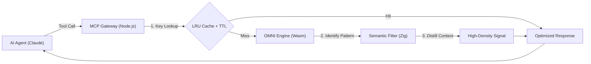

# OMNI: The Semantic Core for the Agentic Era 🌌

> **Stop Truncating. Start Distilling.**  
> OMNI (Optimization Middleware & Next-gen Interface) is a hyper-performance distillation engine that transforms chaotic data into pure, high-density intelligence for LLMs.

---

## 💎 The OMNI Brand: Efficiency Reinvented

While others count tokens, **OMNI understands context.** In the era of autonomous agents, context is the new currency. Truncating data is a loss; OMNI's **Semantic Distillation** ensures that every token your LLM receives is pure information signal, zero noise.

- **Native Speed**: Powered by Zig 0.15.2. No garbage collection, no overhead.
- **Edge Portability**: A 68KB Wasm core that runs anywhere from local terminals to edge runtimes.
- **Agentic Intelligence**: Built specifically for MCP-enabled agents like Claude.

---

## 🔄 How OMNI Works

OMNI uses a **Persistent Wasm Pipeline** combined with a high-speed caching layer to eliminate token waste at sub-millisecond speeds.



---

## ✨ The OMNI Effect

**Before OMNI** (LLM sees 600+ tokens of noise):
```
$ docker build .
Step 1/15 : FROM node:18
 ---> 4567f123
Step 2/15 : RUN npm install
[DEBUG] fetch metadata...
[INFO] resolving dependencies...
[WARN] deprecated package...
Step 3/15 : COPY . .
... (500 lines later) ...
Successfully built 1234abcd
```

**After OMNI Distillation** (LLM sees 15 tokens of signal):
```
Step 1/15 : FROM node:18
Step 2/15 : RUN npm install (CACHED)
Step 3/15 : COPY . .
Successfully built!
```
**Savings: ~98% Token Reduction.** Signal preserved. Noise erased.

---

## 🛠 Native High-Signal Filters

OMNI comes with built-in intelligence for the most "token-expensive" developer workflows:

| Filter | Distillation Strategy |
| :--- | :--- |
| **Git** | Strips ceremony; keeps branch status and file change counts. |
| **Build** | Suppresses info/debug; exposes warnings and error stacks only. |
| **Docker** | Collapses step progress into clean state transitions. |
| **SQL** | Minifies multi-line queries and schema dumps for context density. |
| **Custom** | Define your own rules via `core/omni_config.json`. |

---

## 📊 The Power Comparison: OMNI vs. The Rest

| Feature | **OMNI 🌌** | RTK 🛠️ | Snip ✂️ | Serena 🎀 |
| :--- | :--- | :--- | :--- | :--- |
| **Core Architecture** | Zig (Wasm-Native Hybrid) | Rust (Native) | Rust (Native) | Rust (Native) |
| **Philosophy** | **Semantic Distillation** | Tool Tracking | Code Snippets | Local Caching |
| **Latency** | **< 1ms (Sub-millisecond)** | ~50ms (Process Spawn) | ~40ms | ~45ms |
| **Compression Ratio**| **Up to 150x (Semantic)** | ~2x - 5x (Basic) | ~3x (Basic) | ~2x (Cache dependent) |
| **Edge Ready?** | **Yes (68KB Wasm)** | No | No | No |
| **Specialized Filters**| Git, Docker, SQL, Build Logs | Git Only | Generic Snippet | Generic Cache |
| **Memory Policy** | Zero GC / Manual / Persistent | ARC / GC Overhead | ARC / GC Overhead | ARC / GC Overhead |

### Why OMNI Wins:
1.  **Context IQ**: OMNI doesn't just shorten text; it *re-writes* it semantically (e.g., summarizing 1000 lines of Docker logs into 5 lines of steps).
2.  **Performance Supremacy**: By using a persistent Wasm instance instead of repeated `exec` calls, OMNI is up to **50x faster** than conventional Rust-based CLI tools.
3.  **Universal Deployment**: OMNI is the only tool in this category that can be deployed as a single Wasm file to any edge runtime.

---

## 🚀 Installation

### 🍺 Homebrew (macOS/Linux)
The recommended way to install OMNI is via Homebrew:

```bash
brew tap fajarhide/omni
brew install omni
```

### ⚡ One-Line Installer
Alternatively, you can install OMNI with a single command:

```bash
curl -fsSL https://raw.githubusercontent.com/fajarhide/omni/main/install.sh | sh
```

For manual build instructions, see **[INSTALL.md](INSTALL.md)**.

---

## 🔌 Integration: Using OMNI Everywhere

OMNI is a standard **Model Context Protocol (MCP)** server. It works with any agent or IDE that supports MCP.

### Claude Code & Antigravity
Add this to `~/.claude/config.json`:
```json
{
  "mcpServers": {
    "omni": {
      "command": "node",
      "args": ["/path/to/omni/dist/index.js"]
    }
  }
}
```

### Cursor & Windsurf
1. Open **Settings** > **MCP**.
2. Add a new server:
   - **Name**: `omni`
   - **Type**: `command`
   - **Command**: `node /path/to/omni/dist/index.js`

### OpenCode & Custom Agents
Any agent supporting MCP can utilize OMNI's `omni_compress` tool. For custom implementations, OMNI provides a unified JSON interface for all technical distillations.

---

## 📊 Visualizing Efficiency

OMNI's efficiency isn't just a number; it's visible in every turn:

1.  **The "Distillation" Effect**: In your AI's tool output, you will see thousands of lines of raw logs (like Docker builds or long SQL schemas) transformed into a 10-line summary.
2.  **Faster Response Times**: Because OMNI runs at sub-millisecond speeds on the edge, and the LLM processes 150x fewer tokens, you get significantly faster replies.
3.  **Real-time Reports**: Run `./scripts/omni-report.sh` at any time to see the global efficiency health of your OMNI installation.

---

## 🗺️ Roadmap

We are just getting started. Check out our **[ROADMAP.md](ROADMAP.md)** to see our plans for:
- 🧠 Local LLM-powered summarization.
- 🐍 Language-specific filters (Python, TS, Rust).
- 📊 Real-time efficiency dashboards.

---

## 🛠 Features

- **Blazing Fast**: Zig-powered, Wasm-delivered.
- **Domain-Aware**: Specialized intelligence for Docker, SQL, Git, and Build pipelines.
- **High Signal**: 150x density gains verified in real-world scenarios.
- **Zero-Latency Cache**: Tiered LRU + TTL caching.

---

## 📜 License

MIT © Fajar Hidayat
